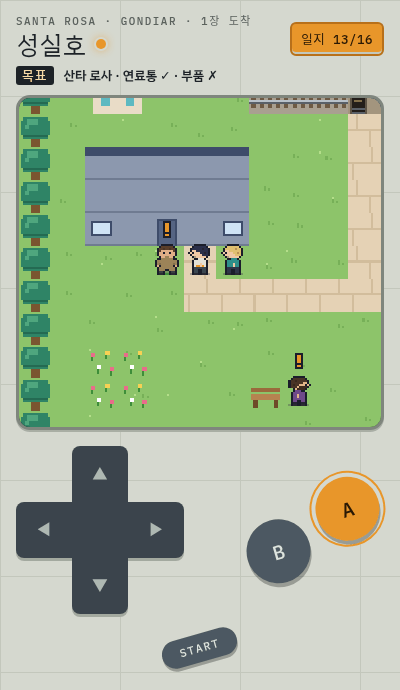
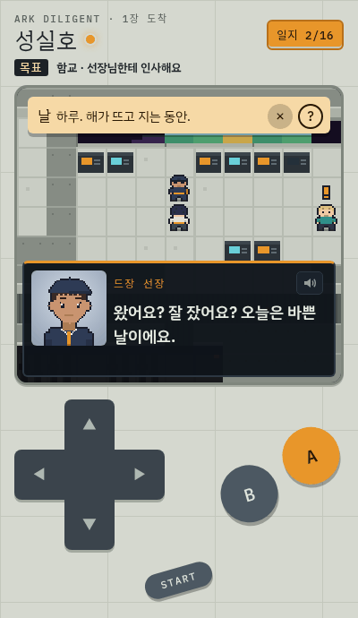
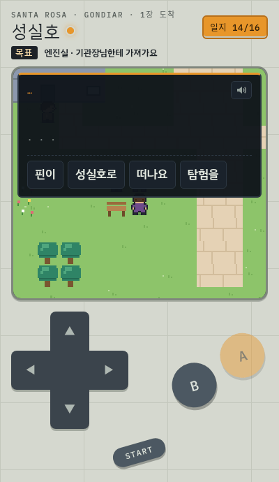
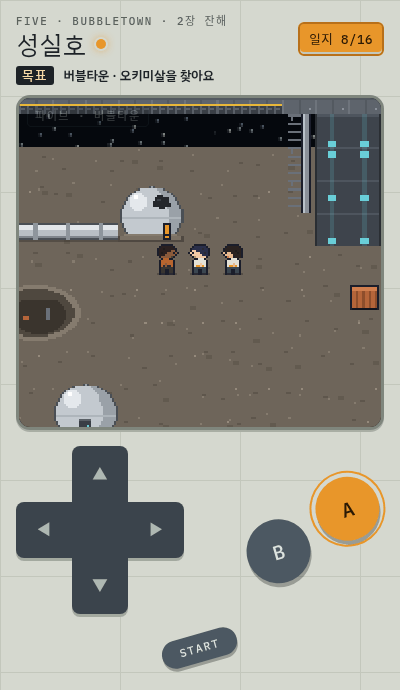
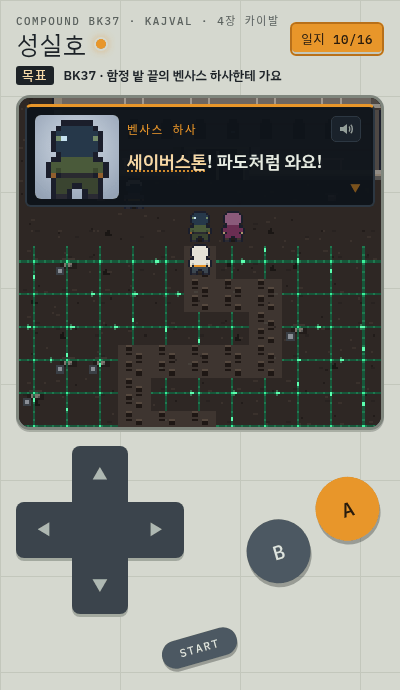
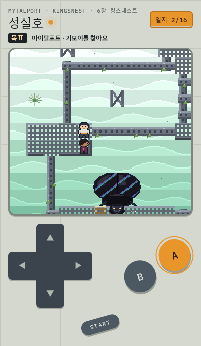

# 성실호

A pixel-art walk-around Korean vocabulary game set in the world of Peter F. Hamilton's *Exodus: The Archimedes Engine*.
Seven chapters follow the arkship *Diligent*; you walk, talk to people, answer questions in Korean, fix things and follow the story.

**Play:** https://stan-stani.github.io/seongsilho/ (built for phones; arrow keys + Z/X on a keyboard)

| | | |
|:-:|:-:|:-:|
|  |  |  |
| 1장 · Santa Rosa | Tap any word: Korean first, English behind ? | Word-order puzzles |
|  |  |  |
| 2장 · Bubbletown | 4장 · Kajval | 6장 · Mytalport |

- 112 words across 7 chapters, each chapter with its own save; spaced review at the signal terminals
- Tap any Korean word for a simple Korean definition; English is behind the **?** button
- Korean speech on devices that have a Korean voice
- Runs on the shared [walk engine](https://github.com/Stan-Stani/walk-engine) with 형제, 방과 후 and 단어 마을

A fan-made learning tool. It contains no text from the novel, and the book itself is not included.

## Build and test
`python3 build.py` assembles `index.html` from `src/`. `node tests/validate.mjs` checks every chapter;
`node tests/play.mjs ch1` plays a chapter in headless Chrome with real key presses and saves screenshots.
The tap-a-word dictionary is built by `lexicon/extract.py` (Kiwi morphological analyzer) + `lexicon/defs.json`.
